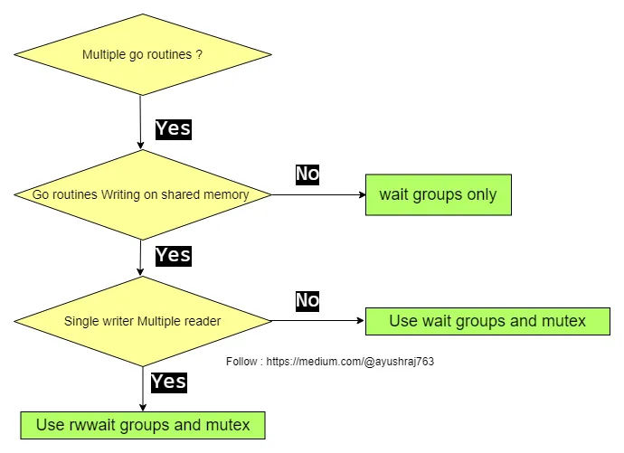

# Go/Java Concurrency

“Concurrency is about dealing with lots of things at once. Parallelism is about doing lots of things at once.” - Rob Pike

Concurrency is a property of the code; parallelism is a property of the running program.

> Concurrency is a _**semantic property of a program or system**_.  Concurrency is when multiple tasks are in progress for overlapping periods of time. Concurrency is a conceptual property of a program or a system, it’s more about how the program or system has been designed. Long story short, concurrency happens when you have context switching between sequential tasks.

Using the same example as Kirill Bobrov uses in [Grokking Concurrency](https://www.manning.com/books/grokking-concurrency), imagine that one cook is chopping salad while occasionally stirring the soup on the stove. He has to stop chopping, check the stove top, and then start chopping again, and repeat this process until everything is done.

As you can see, we only have one processing resource here, the chef, and his concurrency is mostly related to logistics; without concurrency, the chef has to wait until the soup on the stove is ready to chop the salad.

> Parallelism is an _**implementation property**_. It resides on the hardware layer.
>
> Parallelism is about multiple tasks or subtasks of the same task that literally run at the same time on a hardware with multiple computing resources like multi-core processor.

Back in the kitchen, now we have two chefs, one who can do stirring and one who can chop the salad. We’ve divided the work by having another processing resource, another chef.


Concurrency can be parallelised but concurrency does not imply parallelism.\
e.g. In a single-core CPU, you can have concurrency but not parallelism.


\=> We don't write parallel code, only concurrent code that we hope might be ran in parallel.

<figure><figcaption></figcaption></figure>

## Concurrency in Go vs Java

| Concept                    | Go                                                                                                                                                                                                                                                                     | Java                                                                                                                                                                                                                                                                                                                                                                                                                                                                        |
| -------------------------- | ---------------------------------------------------------------------------------------------------------------------------------------------------------------------------------------------------------------------------------------------------------------------- | --------------------------------------------------------------------------------------------------------------------------------------------------------------------------------------------------------------------------------------------------------------------------------------------------------------------------------------------------------------------------------------------------------------------------------------------------------------------------- |
| Multithreading             | through **goroutines**                                                                                                                                                                                                                                                 | through threads via **Thread** class or **Runnable** interface                                                                                                                                                                                                                                                                                                                                                                                                              |
| Memory Space               | goroutines use only <mark style="color:yellow;"></mark> <mark style="color:yellow;"></mark><mark style="color:yellow;">**2 KB**</mark>** of memory space**.                                                                                                            | threads take <mark style="color:yellow;">**2 MB**</mark>** of memory space**                                                                                                                                                                                                                                                                                                                                                                                                |
| Communication Coordination | 
through built in <mark style="color:yellow;"><strong>primivate channels</strong></mark> which are built to handle race conditions => safe and prevents explicit locking;   the data structure that is shared between goroutines doesn't have to be locked
 | <ul><li>Threaded programming uses <mark style="color:yellow;"><strong>locks</strong></mark> in order to access a shared variable. These can to lead to deadlocks and race conditions which are difficult to detect.</li><li>Can only speak to one another through <mark style="color:yellow;"><strong>return values</strong></mark> or <mark style="color:yellow;"><strong>shared (volatile) variables</strong></mark> and are highly costly to build and manage.</li></ul> |
| Scheduling                 | scheduling of goroutines is done by <mark style="color:yellow;">**go runtime**</mark> and hence it is quite faster => context switching is faster                                                                                                                      | the scheduling of threads is done by <mark style="color:yellow;">**OS runtime**</mark> => context switching is slower                                                                                                                                                                                                                                                                                                                                                       |
|                            | thousands of goroutines are multiplexed on one or two OS threads.                                                                                                                                                                                                      | if you launch 1000 threads in JAVA then it would consume lot of resources and these 1000 threads needs to be managed by OS. Moreover each of these threads will be more than 1 MB in size                                                                                                                                                                                                                                                                                   |

## **Scheduling**

Go's mechanism for hosting goroutines is an implementation of what's called an <mark style="color:yellow;">**M:N scheduler**</mark>: which states that <mark style="color:yellow;">**M**</mark> number of goroutines can be distributed over <mark style="color:yellow;">**N**</mark> number of OS threads.

<figure><figcaption></figcaption></figure>

When a Go program starts => it is given a logical processor **P** for every virtual core => Every P is assigned an OS thread **M** => Every Go program is also given an initial G which is the path of execution for a Go program. OS threads are context-switched on and off a core, goroutines are context-switched on and off a M.

There are two run queues in the Go scheduler.

* **Global Run Queue (GRQ)**
* **Local Run Queue (LRQ)**

Each P is given given a LRQ that manages the goroutines assigned to be executed within the context of P. These goroutines take turn being context-switched on and off the M assigned to that P. GRQ is for goroutines that have not been assigned to a P yet.

<figure><figcaption></figcaption></figure>

When a goroutine is performing an asynchronous system call, P can swap the G off M and put in a different G for execution. However, when a goroutine is performing a synchronous system call, the OS thread is effectively blocked. Go scheduler will create a new thread to continue servicing the existing goroutines in the LRQ.

<figure><figcaption></figcaption></figure>

Go follows a model of concurrency called the <mark style="color:yellow;">**fork-join model**</mark>:

* fork - at any point in the program, a _**child**_ branch of execution can be split off and run concurrently with its _**parent**_
* join - at some point in the future, the concurrent branches of execution will join back together

.png>)

## **Synchronizing goroutines** 

To make sure your goroutines execute before the main goroutine we need <mark style="color:yellow;">**join points**</mark>. These can be created via:

1. sync.waitGroup()
