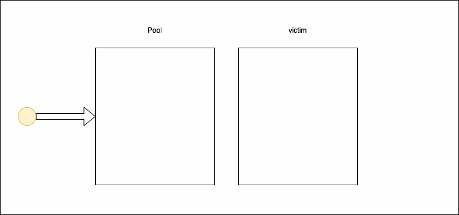

# Memory Optimisation Techniques

* **Use `sync.Pool`**:
  * keeping the GC overhead as little as possible => sync.Pool as a _thread-safe, lock free cache for re-using allocations._ Objects can be cleared any time. It can be particularly useful for objects with a high allocation cost, such as database connections or frequently used temporary objects.


```go
type Test struct {
	A int
}

func main() {
	pool := sync.Pool{
		New: func() interface{} {
			return &Test{
				A: 1,
			}
		},
	}

	testObject := pool.Get().(*Test)
	println(testObject.A) // prints 1

	pool.Put(testObject)
}
```


* each P has its own local pool
*   **how it works**: every `sync.Pool` has two containers for elements: **local pool** and **victim cache**. Every item is put in a local pool. When the GC is running, all elements from the local Pool are moved to the victim cache. If there’s anything in the victim cache before the garbage collection is executed it’s cleared. New items are put in the local Pool, but retrieved items are taken from the victim cache in the first place. If the VC is empty items are taken from the local Pool.\


    <figure><figcaption></figcaption></figure>
* **when to use:** when you have an object that is expensive in the creation, and you have to create it quite often


* **Minimize Allocations**:
  * Avoid unnecessary memory allocations, especially in tight loops or frequently called functions. Reuse variables where possible.
* **String Builder (`strings.Builder`)**:
  * Instead of repeatedly concatenating strings using `+` or `+=`, use `strings.Builder` to efficiently build strings, minimising intermediate string allocations.
* **Slice Capacity**:
  * Preallocate slices with an appropriate capacity when you know the expected size in advance. This can reduce memory reallocations as the slice grows.
* **Avoid Global Variables**:
  * Minimise the use of global variables, as they can stay in memory for the lifetime of the application. Use local variables or limit the scope of globals.
* **Use Pointers Sparingly**:
  * While Go encourages explicit use of pointers, don't overuse them. Pass values by reference when necessary, but avoid unnecessary pointer indirection.
* **Reduce Goroutine Overhead**:
  * Be mindful of goroutine creation. Creating too many goroutines can lead to increased memory usage due to the associated stack space.


Resources:

* [developer20's Using sync.Pool](https://developer20.com/using-sync-pool/)
